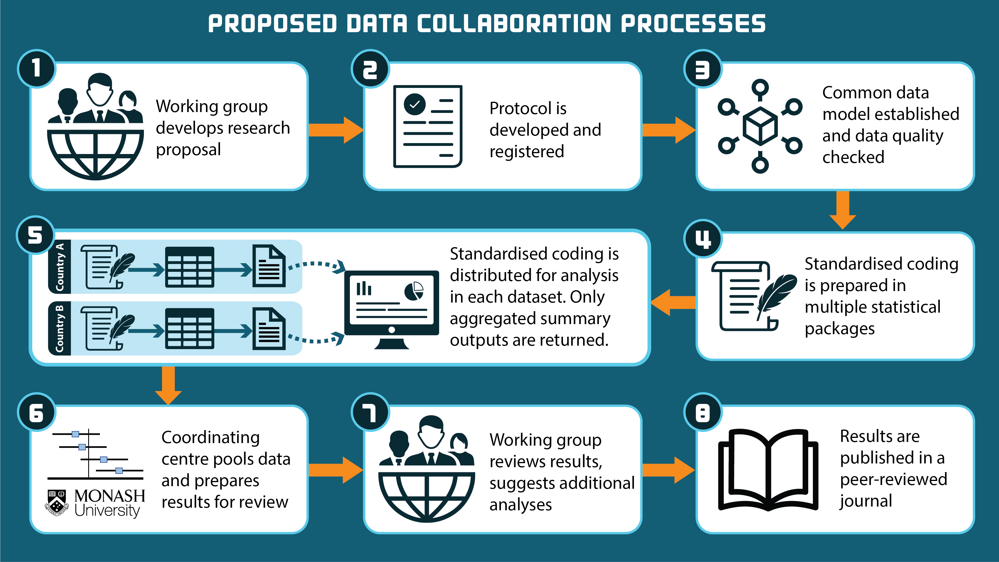

```{r setup, include=FALSE}
knitr::opts_chunk$set(echo = FALSE)
```

<head>
<link rel="preconnect" href="https://fonts.googleapis.com">
<link rel="preconnect" href="https://fonts.gstatic.com" crossorigin>
<link href="https://fonts.googleapis.com/css2?family=Roboto:ital,wght@0,100;0,300;0,400;0,500;0,700;0,900;1,100;1,300;1,400;1,500;1,700;1,900&display=swap" rel="stylesheet">
</head>

# What is INSPIRE-STROKE?

<div style='text-align: justify;'>
Stroke is a leading cause of death and disability globally. With recent advancements in the availability of electronic health data, new opportunities exist to leverage Big Data (e.g. population-level administrative or registry data) being collected around the world to gain deeper insights on the health impacts of stroke globally.
</div>

<div style='text-align: justify;'>
INSPIRE-STROKE was established in 2023 to address current gaps in the surveillance of stroke globally, across important treatment outcomes such as:
</div>

1.  Readmissions
2.  Medication utilisation 
3.  Mortality
4.  Health economics
5.  Patient-reported outcomes

<div style='text-align: justify;'>
This network of international researchers collaborate and apply standardised methods to assess and report health outcomes following stroke to inform policy and practice. 
</div>


# Our Vision
<div style='text-align: justify;'>
The vision of INSPIRE-STROKE is to create an enduring system for routine international pooling of Big Data on important stroke outcomes that are not covered in current systems.
</div>

INSPIRE-STROKE will monitor outcomes following stroke by:

-  Comparing country-level observational data
-  Fostering a scientific community to facilitate international benchmarking
-  Using advanced methods and best-practice standards to ensure findings are reliable and robust.

# How INSPIRE-STROKE works?



# Funding

<div style='text-align: justify;'>
The initial establishment of INSPIRE-STROKE is being funded by a pilot project grant awarded from the STOPstroke NHMRC Synergy Grant. Research fellowship support has also been obtained from the National Heart Foundation of Australia for investigators A/Prof Kilkenny (105737) and Dr Dalli (107125).
</div>
