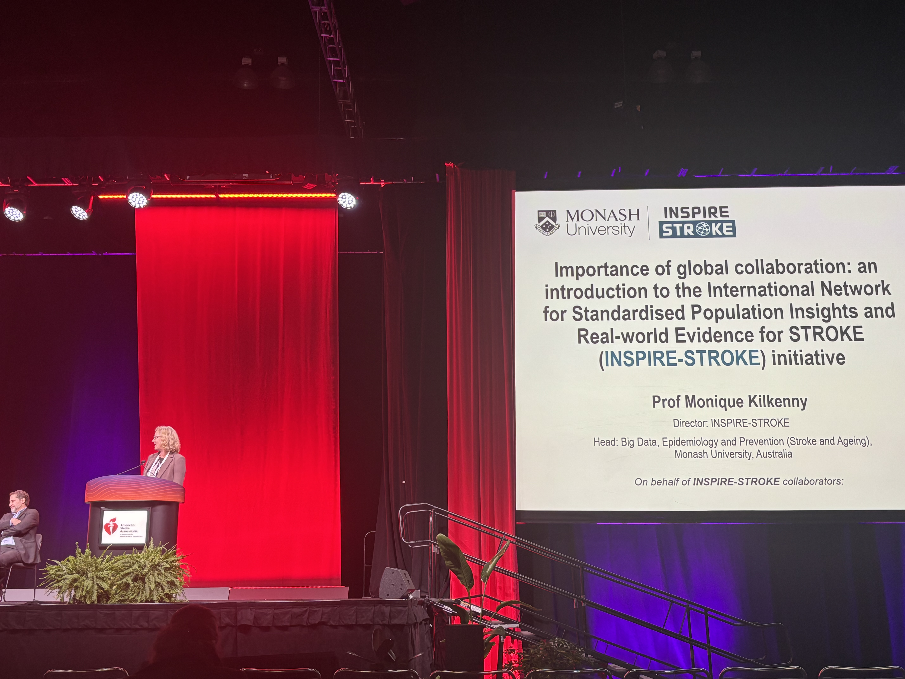
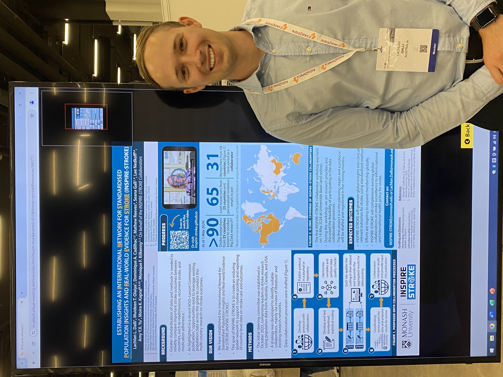

```{r setup, include=FALSE}
knitr::opts_chunk$set(echo = FALSE)

```


```{css}
img {
  margin-bottom: 0 ;
  padding-bottom: 0 ;
  display: block;
  border: 0
}


summary {
  cursor: pointer;
}
```

<html>
<meta charset="utf-8">
<title>Redirecting…</title>
<meta http-equiv="refresh" content="0; URL=https://inspire-stroke.bigdatacvd.com/outputs">
<link rel="canonical" href="https://inspire-stroke.bigdatacvd.com/outputs">

<p>A new website is released. If you are not redirected automatically, <a href="https://inspire-stroke.bigdatacvd.com/outputs">click here</a>.</p>
</html>

<head>
<link rel="preconnect" href="//fonts.googleapis.com">
<link rel="preconnect" href="//fonts.gstatic.com" crossorigin>
<link href="//fonts.googleapis.com/css2?family=Roboto:ital,wght@0,100;0,300;0,400;0,500;0,700;0,900;1,100;1,300;1,400;1,500;1,700;1,900&display=swap" rel="stylesheet">
</head>


# Media
<a href="https://isc.hub.heart.org/daily-coverage/article/22931770/accessing-data-to-improve-outcomes" target="_blank">Accessing data to improve outcomes. International Stroke Conference Magazines. 6 Feb 2025.</a>

<details>
<summary>Click to show website</summary>
<iframe src="https://isc.hub.heart.org/daily-coverage/article/22931770/accessing-data-to-improve-outcomes" width="100%" height="600px"></iframe>
</details>

----

# Conference Abstracts

### International Stroke Conference
<p style = "font-size: 16px;">Kilkenny MF, Reeves M, Yu AYX. Establishing an International Network for Standardised Population Insights and Real-World Evidence for Stroke (INSPIRE-STROKE). International Stroke Conference. Los Angeles, USA. 5-7 Feb 2025. [poster presentation]</p>
<details>
<summary><i class="fa-solid fa-image"></i></summary>

</details>

### 10th European Stroke Organisation Conference
<p style = "font-size: 16px;">Dalli LL, Olaiya MT, Cadilhac DA, Reeves M, Gall S, Nedkoff L, Yu AYX, Kapral MK, Kilkenny MF. Establishing an International Network for Standardised Population Insights and Real-World Evidence for Stroke (INSPIRE-STROKE). 10th European Stroke Organisation Conference. Basel, Switzerland. 15-17 May 2024. [poster presentation]</p>
<details>
<summary><i class="fa-solid fa-image"></i></summary>

</details>

----

# Publications
1. Yu AYX, Bravata DM, Norrving B, Reeves MJ, Liu L, Kilkenny MF. Measuring Stroke Quality: Methodological Considerations in Selecting, Defining, and Analyzing Quality Measures. Stroke. 2022;53(10):3214-3221. <a href="https://doi.org/10.1161/strokeaha.122.036485" target="_blank">doi:10.1161/STROKEAHA.122.036485</a>
